

     

<h3 align="center"> Universidad Peruana de Ciencias Aplicadas </h3>

<h3 align="center">Carrera de  Ingeniería de Software </h3>

<h3 align="center">1ASI0729 </h3>
<h3 align="center">Desarrollo de Aplicaciones Open Source</h3>
<h3 align="center"> NRC </h3>
<h3 align="center"> 7747 </h3>

<h3 align="center">Informe del Trabajo Final</h3>

<h3 align="center"> Docente</h3>
<h3 align="center">Bautista Ubillús, Efraín Ricardo </h3>

<h3 align="center"> Equipo </h3>
<h3 align="center">TerraNova</h3>

<h3 align="center"> Proyecto</h3>
<h3 align="center"> TerraNova Platform </h3>

<h3 align="center"> Integrantes </h3>

| Code | Member |
| :---: | :--- |
| u20241f246 | Atauje Barreto, Alexander Sebastián |
| u202215188 | Egocheaga Suyo, Miguel Angel |
| u202116018 | Orellana Rodríguez, Mel Andree |
| U20231h171 | Vera Solsol, Nayely Macarena |
| u202318001 |Raymundo Villarroel, Abigail Nadhim |

<h3 align="center">Periodo 202620</h3>
<h3 align="center">Agosto, 2026</h3>

## Registro de Versiones del Informe

| Versión |    Fecha    |                Autor                |                                                                                                Descripción de modificación                                                                                                |
|:-------:|:----------:|:-----------------------------------:|:-------------------------------------------------------------------------------------------------------------------------------------------------------------------------------------------------------------------------:|
| [Versión] | [DD-MM-AAAA] | [Apellidos, Nombres] | [Descripción del cambio o aporte] |

## Project Report Collaboration Insights

| Integrante | Tareas Asignadas |
|---|---|
| [Nombre Completo 1] | [Lista de tareas realizadas] |
| [Nombre Completo 2] | [Lista de tareas realizadas] |
| [Nombre Completo 3] | [Lista de tareas realizadas] |
| [Nombre Completo 4] | [Lista de tareas realizadas] |
| [Nombre Completo 5] | [Lista de tareas realizadas] |

El proceso de colaboración en el informe se realizó mediante commits constantes al repositorio de la organización.

## Tabla de Contenidos

* [Capítulo I: Introducción](#capítulo-i-introducción)
  * [1.1. Startup Profile](#11-startup-profile)
    * [1.1.1. Descripción de la Startup](#111-descripción-de-la-startup)
    * [1.1.2. Perfiles de integrantes del equipo](#112-perfiles-de-integrantes-del-equipo)
  * [1.2. Solution Profile](#12-solution-profile)
    * [1.2.1. Antecedentes y problemática](#121-antecedentes-y-problemática)
    * [1.2.2. Lean UX Process](#122-lean-ux-process)
      * [1.2.2.1. Lean UX Problem Statements](#1221-lean-ux-problem-statements)
      * [1.2.2.2. Lean UX Assumptions](#1222-lean-ux-assumptions)
      * [1.2.2.3. Lean UX Hypothesis Statements](#1223-lean-ux-hypothesis-statements)
      * [1.2.2.4. Lean UX Canvas](#1224-lean-ux-canvas)
  * [1.3. Segmentos objetivo](#13-segmentos-objetivo)
* [Capítulo II: Requirements Elicitation & Analysis](#capítulo-ii-requirements-elicitation--analysis)
  * [2.1. Competidores](#21-competidores)
    * [2.1.1. Análisis competitivo](#211-análisis-competitivo)
    * [2.1.2. Estrategias y tácticas frente a competidores](#212-estrategias-y-tácticas-frente-a-competidores)
  * [2.2. Entrevistas](#22-entrevistas)
    * [2.2.1. Diseño de entrevistas](#221-diseño-de-entrevistas)
    * [2.2.2. Registro de entrevistas](#222-registro-de-entrevistas)
    * [2.2.3. Análisis de entrevistas](#223-análisis-de-entrevistas)
  * [2.3. Needfinding](#23-needfinding)
    * [2.3.1. User Personas](#231-user-personas)
    * [2.3.2. User Task Matrix](#232-user-task-matrix)
    * [2.3.3. User Journey Mapping](#233-user-journey-mapping)
    * [2.3.4. Empathy Mapping](#234-empathy-mapping)
  * [2.4. Big Picture Event Storming](#24-big-picture-event-storming)
  * [2.5. Ubiquitous Language](#25-ubiquitous-language)
* [Capítulo III: Requirements Specification](#capítulo-iii-requirements-specification)
  * [3.1. User Stories](#31-user-stories)
  * [3.2. Impact Mapping](#32-impact-mapping)
  * [3.3. Product Backlog](#33-product-backlog)
* [Capítulo IV: Product Design](#capítulo-iv-product-design)
  * [4.1. Style Guidelines](#41-style-guidelines)
    * [4.1.1. General Style Guidelines](#411-general-style-guidelines)
    * [4.1.2. Web Style Guidelines](#412-web-style-guidelines)
  * [4.2. Information Architecture](#42-information-architecture)
    * [4.2.1. Organization Systems](#421-organization-systems)
    * [4.2.2. Labeling Systems](#422-labeling-systems)
    * [4.2.3. SEO Tags and Meta Tags](#423-seo-tags-and-meta-tags)
    * [4.2.4. Searching Systems](#424-searching-systems)
    * [4.2.5. Navigation Systems](#425-navigation-systems)
  * [4.3. Landing Page UI Design](#43-landing-page-ui-design)
    * [4.3.1. Landing Page Wireframe](#431-landing-page-wireframe)
    * [4.3.2. Landing Page Mock-up](#432-landing-page-mock-up)
  * [4.4. Web Applications UX/UI Design](#44-web-applications-uxui-design)
    * [4.4.1. Web Applications Wireframes](#441-web-applications-wireframes)
    * [4.4.2. Web Applications Wireflow Diagrams](#442-web-applications-wireflow-diagrams)
    * [4.4.3. Web Applications Mock-ups](#443-web-applications-mock-ups)
    * [4.4.4. Web Applications User Flow Diagrams](#444-web-applications-user-flow-diagrams)
  * [4.5. Web Applications Prototyping](#45-web-applications-prototyping)
  * [4.6. Domain-Driven Software Architecture](#46-domain-driven-software-architecture)
    * [4.6.1. Design-Level Event Storming](#461-design-level-event-storming)
    * [4.6.2. Software Architecture Context Diagram](#462-software-architecture-context-diagram)
    * [4.6.3. Software Architecture Container Diagrams](#463-software-architecture-container-diagrams)
    * [4.6.4. Software Architecture Components Diagrams](#464-software-architecture-components-diagrams)
  * [4.7. Software Object-Oriented Design](#47-software-object-oriented-design)
    * [4.7.1. Class Diagrams](#471-class-diagrams)
  * [4.8. Database Design](#48-database-design)
    * [4.8.1. Database Diagrams](#481-database-diagrams)
* [Capítulo V: Product Implementation, Validation & Deployment](#capítulo-v-product-implementation-validation--deployment)
  * [5.1. Software Configuration Management](#51-software-configuration-management)
    * [5.1.1. Software Development Environment Configuration](#511-software-development-environment-configuration)
    * [5.1.2. Source Code Management](#512-source-code-management)
    * [5.1.3. Source Code Style Guide & Conventions](#513-source-code-style-guide--conventions)
    * [5.1.4. Software Deployment Configuration](#514-software-deployment-configuration)
  * [5.2. Landing Page, Services & Applications Implementation](#52-landing-page-services--applications-implementation)
    * [5.2.1. Sprint 1](#521-sprint-1)
      * [5.2.1.1. Sprint Planning 1](#5211-sprint-planning-1)
      * [5.2.1.2. Aspect Leaders and Collaborators](#5212-aspect-leaders-and-collaborators)
      * [5.2.1.3. Sprint Backlog 1](#5213-sprint-backlog-1)
      * [5.2.1.4. Development Evidence for Sprint Review](#5214-development-evidence-for-sprint-review)
      * [5.2.1.5. Execution Evidence for Sprint Review](#5215-execution-evidence-for-sprint-review)
      * [5.2.1.6. Services Documentation Evidence for Sprint Review](#5216-services-documentation-evidence-for-sprint-review)
      * [5.2.1.7. Software Deployment Evidence for Sprint Review](#5217-software-deployment-evidence-for-sprint-review)
      * [5.2.1.8. Team Collaboration Insights during Sprint](#5218-team-collaboration-insights-during-sprint)
    * [5.2.2. Sprint 2](#522-sprint-2)
      * [5.2.2.1. Sprint Planning 2](#5221-sprint-planning-2)
      * [5.2.2.2. Aspect Leaders and Collaborators](#5222-aspect-leaders-and-collaborators)
      * [5.2.2.3. Sprint Backlog 2](#5223-sprint-backlog-2)
      * [5.2.2.4. Development Evidence for Sprint Review](#5224-development-evidence-for-sprint-review)
      * [5.2.2.5. Execution Evidence for Sprint Review](#5225-execution-evidence-for-sprint-review)
      * [5.2.2.6. Services Documentation Evidence for Sprint Review](#5226-services-documentation-evidence-for-sprint-review)
      * [5.2.2.7. Software Deployment Evidence for Sprint Review](#5227-software-deployment-evidence-for-sprint-review)
      * [5.2.2.8. Team Collaboration Insights during Sprint](#5228-team-collaboration-insights-during-sprint)
    * [5.2.3. Sprint 3](#523-sprint-3)
      * [5.2.3.1. Sprint Planning 3](#5231-sprint-planning-3)
      * [5.2.3.2. Aspect Leaders and Collaborators](#5232-aspect-leaders-and-collaborators)
      * [5.2.3.3. Sprint Backlog 3](#5233-sprint-backlog-3)
      * [5.2.3.4. Development Evidence for Sprint Review](#5234-development-evidence-for-sprint-review)
      * [5.2.3.5. Execution Evidence for Sprint Review](#5235-execution-evidence-for-sprint-review)
      * [5.2.3.6. Services Documentation Evidence for Sprint Review](#5236-services-documentation-evidence-for-sprint-review)
      * [5.2.3.7. Software Deployment Evidence for Sprint Review](#5237-software-deployment-evidence-for-sprint-review)
      * [5.2.3.8. Team Collaboration Insights during Sprint](#5238-team-collaboration-insights-during-sprint)
    * [5.2.4. Sprint 4](#524-sprint-4)
      * [5.2.4.1. Sprint Planning 4](#5241-sprint-planning-4)
      * [5.2.4.2. Aspect Leaders and Collaborators](#5242-aspect-leaders-and-collaborators)
      * [5.2.4.3. Sprint Backlog 4](#5243-sprint-backlog-4)
      * [5.2.4.4. Development Evidence for Sprint Review](#5244-development-evidence-for-sprint-review)
      * [5.2.4.5. Execution Evidence for Sprint Review](#5245-execution-evidence-for-sprint-review)
      * [5.2.4.6. Services Documentation Evidence for Sprint Review](#5246-services-documentation-evidence-for-sprint-review)
      * [5.2.4.7. Software Deployment Evidence for Sprint Review](#5247-software-deployment-evidence-for-sprint-review)
      * [5.2.4.8. Team Collaboration Insights during Sprint](#5248-team-collaboration-insights-during-sprint)
  * [5.3. Validation Interviews](#53-validation-interviews)
    * [5.3.1. Diseño de Entrevistas](#531-diseño-de-entrevistas)
    * [5.3.2. Registro de Entrevistas](#532-registro-de-entrevistas)
    * [5.3.3. Evaluaciones según heurísticas](#533-evaluaciones-según-heurísticas)
  * [5.4. Video About-the-Product](#54-video-about-the-product)
* [Conclusiones y Recomendaciones](#conclusiones-y-recomendaciones)
* [Video App Validation](#video-app-validation)
* [Video About the product](#video-about-the-product)
* [Video About the team](#video-about-the-team)
* [Glosario](#glosario)
* [Bibliografía](#bibliografía)
* [Anexos](#anexos)

# Student Outcome

  <table style="width:100%; border-collapse: collapse; font-family: Arial, sans-serif; font-size: 14px;">
    <thead>
      <tr style="background-color: #f2f2f2; text-align: center;">
        <th style="border: 1px solid #dddddd; padding: 12px; width: 25%;">Criterio específico</th>
        <th style="border: 1px solid #dddddd; padding: 12px; width: 45%;">Acciones realizadas</th>
        <th style="border: 1px solid #dddddd; padding: 12px; width: 30%;">Conclusiones</th>
      </tr>
    </thead>
    <tbody>
      <tr>
        <td style="border: 1px solid #dddddd; padding: 10px; font-weight: bold; vertical-align: top;">
          Trabaja en equipo para proporcionar liderazgo en forma conjunta.
        </td>
        <td style="border: 1px solid #dddddd; padding: 10px; vertical-align: top;">
          <ul>
            <li><b>[Entrega] - [Nombre del Integrante]:</b> [Descripción de la acción realizada]</li>
          </ul>
        </td>
        <td style="border: 1px solid #dddddd; padding: 10px; vertical-align: top;">
          [Conclusión sobre el criterio]
        </td>
      </tr>
      <tr>
        <td style="border: 1px solid #dddddd; padding: 10px; font-weight: bold; vertical-align: top;">
          Crea un entorno colaborativo e inclusivo, establece metas, planifica tareas y cumple objetivos.
        </td>
        <td style="border: 1px solid #dddddd; padding: 10px; vertical-align: top;">
          <ul>
            <li><b>[Entrega] - [Nombre del Integrante]:</b> [Descripción de la acción realizada]</li>
          </ul>
        </td>
        <td style="border: 1px solid #dddddd; padding: 10px; vertical-align: top;">
          [Conclusión sobre el criterio]
        </td>
      </tr>
    </tbody>
  </table>

# Capítulo I: Introducción

## 1.1. Startup Profile
### 1.1.1. Descripción de la Startup
### 1.1.2. Perfiles de integrantes del equipo

## 1.2. Solution Profile
### 1.2.1. Antecedentes y problemática
### 1.2.2. Lean UX Process
#### 1.2.2.1. Lean UX Problem Statements
#### 1.2.2.2. Lean UX Assumptions
#### 1.2.2.3. Lean UX Hypothesis Statements
#### 1.2.2.4. Lean UX Canvas

## 1.3. Segmentos objetivo

# Capítulo II: Requirements Elicitation & Analysis

## 2.1. Competidores
### 2.1.1. Análisis competitivo
### 2.1.2. Estrategias y tácticas frente a competidores

## 2.2. Entrevistas
### 2.2.1. Diseño de entrevistas
### 2.2.2. Registro de entrevistas
### 2.2.3. Análisis de entrevistas

## 2.3. Needfinding
### 2.3.1. User Personas
### 2.3.2. User Task Matrix
### 2.3.3. User Journey Mapping
### 2.3.4. Empathy Mapping

## 2.4. Big Picture Event Storming

## 2.5. Ubiquitous Language

# Capítulo III: Requirements Specification

## 3.1. User Stories

## 3.2. Impact Mapping

## 3.3. Product Backlog

# Capítulo IV: Product Design

## 4.1. Style Guidelines

Esta sección establece los lineamientos visuales y de comunicación que garantizan la coherencia de ALLPATEK en todos sus puntos de contacto. Con el fin de construir una plataforma intuitiva y confiable para el sector agrícola, se define un sistema de diseño centralizado que abarca desde la identidad de marca, tipografía y paleta de colores dual, hasta las pautas específicas para las interfaces web.

### 4.1.1. General Style Guidelines

#### Branding e Identidad Visual
* **Concepto:** Conectar la tecnología financiera moderna con la solidez de la tierra. La marca refleja seguridad en la custodia de pagos (*escrow*), profesionalismo en acuerdos B2B y trazabilidad agrícola directa.
* **Logotipo:** Tipografía sans-serif geométrica acompañada de un isotipo de hoja y acentos dorados, simbolizando la unión entre el crecimiento orgánico del campo y el valor económico protegido.

#### Paleta de Colores (Colors)
El sistema cromático se divide estratégicamente en dos entornos para responder a los objetivos de cada interfaz: la atracción/conversión en la web pública y la eficiencia operativa en el dashboard privado.

#### A. Paleta de la Landing Page (Sitio Web Público)
Diseñada para captar la atención, comunicar modernidad y guiar al usuario hacia la conversión.

* **Verde Menta (`#34D399`):** Utilizado para acentos visuales, iconos destacados e insignias de valor.
* **Amarillo Vivo (`#FACC15`):** Reservado para botones de llamada a la acción principal (CTA) y destacados de alta prioridad.
* **Verde Profundo (`#0F2A1D`):** Funciona como tono base para tarjetas de servicios, contenedores y contraste con el fondo.
* **Verde Oliva / Neutro (`#626751`):** Aplicado en bloques secundarios y delimitaciones de sección.
* **Gris Claro (`#E4E4E4`):** Color neutro para fondos de contraste y lectura limpia de bloques extensos.

#### B. Paleta de la Aplicación Web (Dashboard / App Interna)
Optimizada para reducir la fatiga visual (*Dark Mode*), mantener una jerarquía financiera clara y facilitar el uso prolongado.

* **Verde Bosque Oscuro (`#0F1E13`):** Fondo principal de la aplicación que proporciona una estética moderna y profesional.
* **Verde Esmeralda (`#2D6A4F`):** Identifica el estado activo en la barra de navegación lateral (Sidebar), bordes de validación y botones secundarios.
* **Dorado Maíz (`#E9C46A`):** Color de acento de alta jerarquía usado en montos retenidos en *Escrow*, botones de acción principal y aprobaciones.
* **Gris Neutral (`#E4E4E4`):** Utilizado para la tipografía principal, etiquetas de formularios e íconos operativos.

#### Tipografía (Typography)
* **Títulos y Encabezados:** Se adopta **Fjalla One**, una tipografía *display* sans-serif condensada que otorga personalidad, fuerza y un carácter industrial/agrícola a los titulares principales de la plataforma.
* **Cuerpo de Texto y Datos:** Se utiliza **Inter** (o **Roboto** como alternativa secundaria) por su excelente legibilidad en pantallas de alta densidad, facilitando la lectura de coordenadas GPS, tablas de hitos financieros y formularios técnicos.

#### Espaciado y Rejilla (Spacing & Layout)
* **Sistema de 8px:** Todos los márgenes internos (*padding*) y externos (*margin*) siguen múltiplos de 8px (8, 16, 24, 32, 48px) para mantener un ritmo visual armónico.
* **Efecto Glassmorphism:** Implementación de tarjetas semi-transparentes (`rgba(255, 255, 255, 0.05)`) con bordes sutiles y desenfoque de fondo (`backdrop-blur-md`) para estructurar la información sin recargar la pantalla.

#### Tono de Comunicación y Lenguaje (Voice & Tone)

| Dimensión | Posición | Justificación |
| :--- | :--- | :--- |
| **Divertido / Serio** | **Serio (80%)** | Maneja contratos de arrendamiento y fondos monetarios en custodia, por lo que las instrucciones y estados deben ser precisos y libres de ambigüedades. |
| **Formal / Casual** | **Profesional equilibrado (60% Formal)** | Se comunica de forma accesible con el agricultor en el campo, pero manteniendo la estructura técnica que exige un comprador o empresa B2B. |
| **Respetuoso / Irreverente** | **Respetuoso (100%)** | Muestra empatía ante los riesgos climáticos del agricultor y la inversión del comprador, ofreciendo siempre soporte claro y guiado. |
| **Entusiasta / Sereno** | **Sereno (75%)** | Transmite calma frente a situaciones de alerta (ej: heladas o demoras) presentando soluciones claras mediante la automatización de avisos. |

### 4.1.2. Web Style Guidelines

Esta sección detalla los estándares visuales y de interacción aplicados al diseño de la plataforma web. Para garantizar una experiencia fluida y consistente en cualquier resolución, la interfaz de la landing page y el dashboard fueron diseñados en Figma aplicando principios de maquetación *responsive* estructurados mediante sistemas de rejilla adaptativa (*grid layouts*) y contenedores flexibles (*auto-layout*).

Esta arquitectura visual asegura la compatibilidad directa con los *breakpoints* estándar del mercado (pantallas de escritorio, laptops y tabletas), permitiendo que los elementos se reorganicen de forma intuitiva sin perder jerarquía ni legibilidad.

* **Estructura y Grid Responsive:** Maquetación basada en una rejilla adaptativa de 12 columnas (Tailwind CSS) con márgenes y canaletas (*gutters*) proporcionales que se ajustan según el ancho de pantalla.
* **Layout Shell del Dashboard:**
  * **Sidebar Fijo / Colapsable:** Navegación lateral de 260px que se adapta o repliega según el espacio disponible para priorizar el área de trabajo.
  * **Header Superior:** Barra de contexto que mantiene fijos el perfil del usuario, el rol activo y el centro de notificaciones.
* **Comportamiento Adaptativo en Figma:** Uso de reglas de restricción (*constraints*) y reescalado de contenedores para que componentes críticos como las tarjetas de parcelas, tablas de hitos y paneles financieros mantengan una proporción adecuada en cualquier monitor.

## 4.2. Information Architecture

En esta sección se detallan las decisiones y el sustento que estructuran la organización del contenido en la landing page y en las aplicaciones web y móviles de ALLPATEK. La arquitectura de información propuesta busca minimizar la carga cognitiva y facilitar la navegabilidad, asegurando que los usuarios exploren la plataforma con intuición y encuentren rápidamente los módulos de contratación, seguimiento de parcelas y Bóveda Escrow. Para lograr una experiencia fluida y accesible

### 4.2.1. Organization Systems

En esta sección se determinan las estructuras y criterios para agrupar y presentar la información en la plataforma **ALLPATEK**, facilitando que tanto los agricultores como los compradores B2B reconozcan el flujo visual y operen con claridad.

#### 1. Formas de Organización Visual del Contenido

**Organización Jerárquica:** Se aplica en la página principal pública y en los paneles de control de cada usuario. Se utilizan tamaños de letra, colores destacados y tarjetas visuales para darle prioridad a los datos más importantes, como la descripción del servicio, los montos retenidos en garantía y el estado actual de los contratos.
* **Organización Secuencial (Paso a Paso):** Se utiliza en los procesos que requieren cumplir ordenadamente con varios pasos. Esto incluye el registro de parcelas, la creación y firma de contratos agrícolas, y la liberación por etapas de los pagos conforme se aprueban las evidencias del trabajo en el campo.
* **Organización Matricial:** Se aplica en las tablas comparativas de terrenos y ofertas. Permite visualizar y comparar varios datos a la vez en una misma pantalla, como el nivel de riesgo del clima, el rendimiento proyectado, el costo por hectárea y el tipo de riego disponible.

#### 2. Esquemas de Categorización del Contenido

* **Por Tipo de Usuario (Audiencia):** Es la forma principal de organizar la aplicación. Al iniciar sesión, el sistema adapta el menú según el perfil de la persona:
  * *Vista del Agricultor:* Muestra herramientas para publicar hectáreas, subir fotos del avance del cultivo y revisar los pagos recibidos por cada hito cumplido.
  * *Vista del Comprador B2B:* Muestra herramientas para explorar el catálogo de terrenos, simular contratos de producción y hacer seguimiento a los pagos en custodia.
* **Por Secciones o Módulos Funcionales:** La información se agrupa en menús conceptuales sencillos: *Mis Contratos*, *Fondos en Garantía*, *Seguimiento y Evidencias*, *Alertas del Clima* y *Fichas Técnicas*.
* **Por Orden Cronológico:** Se aplica para ordenar el historial de pagos, el registro de evidencias con fecha y hora, y el historial de avisos meteorológicos.
* **Por Orden Alfabético:** Se utiliza como criterio secundario para ordenar listas extensas, como catálogos de insumos, tipos de cultivos y regiones del país.

  
### 4.2.2. Labeling Systems

En esta sección se definen las convenciones de etiquetado de la plataforma **ALLPATEK**. Para evitar la confusión de los usuarios, se emplean términos breves, claros y de uso común, reduciendo la cantidad de palabras por etiqueta y manteniendo una asociación directa entre la palabra elegida y la acción o contenido representado.

#### 1. Etiquetas de Navegación Principal
Consisten en nombres breves para las secciones globales del menú, orientando al usuario de forma inmediata sobre el módulo en el que se encuentra:

* **Parcelas:** Gestión, registro y catálogo de terrenos agrícolas.
* **Contratos:** Creación, revisión y firma de acuerdos de producción.
* **Garantía:** Módulo de custodia de fondos (*Escrow*) y estado de pagos.
* **Evidencias:** Registro de fotos, videos y datos de campo reportados.
* **Alertas:** Avisos meteorológicos y notificaciones de riesgo.

#### 2. Etiquetas de Estado de Procesos
Representan el progreso de un contrato o pago mediante palabras clave asociadas a colores estandarizados para reflejar su condición:

* **En Custodia:** Fondos depositados en la garantía a la espera de validación.
* **Aprobado:** Hito o evidencia validada con éxito.
* **Liberado:** Pago transferido al agricultor tras cumplir el hito.
* **Observado:** Evidencia que requiere corrección o sustento adicional.

#### 3. Etiquetas de Acción (Llamados a la Acción / Botones)
Utilizan verbos precisos en infinitivo para que el usuario entienda exactamente la consecuencia de su interacción:

* **Registrar Parcela:** Inicia el formulario de alta de terreno.
* **Firmar Contrato:** Confirma el acuerdo formal entre las partes.
* **Subir Evidencia:** Abre la cámara o la carga de archivos de campo.
* **Aprobar Hito:** Autoriza la conformidad de una etapa cumplida.
* **Descargar Ficha:** Genera el documento técnico en PDF.

#### 4. Asociaciones y Simbología de Apoyo
Para reforzar la comprensión rápida sin saturar de texto la pantalla, cada etiqueta clave se asocia a un icono reconocible y a un color representativo:

* **Icono de Hoja / Terreno + "Parcelas":** Asociado al módulo de tierras.
* **Icono de Candado / Escudo + "Garantía":** Asociado a la seguridad financiera de los fondos.
* **Color Verde + "Aprobado":** Confirmación visual de éxito.
* **Color Ámbar + "Observado":** Indicador visual de atención o revisión necesaria.

### 4.2.3. SEO Tags and Meta Tags

Para optimizar la visibilidad en motores de búsqueda (SEO) y asegurar una presentación clara y uniforme al compartir enlaces externos, se estructuran los metadatos principales de la plataforma ALLPATEK. Esta configuración diferencia las secciones públicas de la Landing Page frente a los módulos privados de la Web Application, aplicando directivas específicas para resguardar la privacidad de la información.

| Tipo de Experiencia | Sección / Módulo | Title | Meta Description | Meta Keywords | Meta Author / Robots |
| :--- | :--- | :--- | :--- | :--- | :--- |
| **Landing Page** | Inicio (*Hero Section*) | Producción Agrícola Garantizada | Conectamos compradores B2B con agricultores mediante parcelas gestionadas, pagos protegidos y trazabilidad en tiempo real. | agro as a service, trazabilidad, parcelas, custodia escrow | **Author:** Equipo ALLPATEK |
| **Landing Page** | Garantía de Pagos por Hitos | Custodia Escrow | Liberación gradual de fondos respaldada por la verificación en campo mediante evidencias GPS e inspección de cosechas. | garantia de pagos, pago por hitos, verificacion en campo | **Author:** Equipo ALLPATEK |
| **Landing Page** | Planes de Producción | Planes de Producción | Escoja la escala de cultivo y las herramientas de trazabilidad ideales para su abastecimiento: Básico, Pro y Empresarial. | planes de produccion, suscripcion agricola, contratos PDF | **Author:** Equipo ALLPATEK |
| **Landing Page** | Contacto y Propuesta Técnica | Propuesta Técnica | Recibe el desglose de costos y el modelo de custodia financiera en tu correo. Cotiza parcelas e inicia tu proyecto. | cotizar parcela, propuesta tecnica, contacto B2B | **Author:** Equipo ALLPATEK |
| **Web Application** | Gestión de Parcelas | Catálogo de Parcelas | Explora y administra las opciones disponibles, filtrando por tipo de suelo, zona geográfica y capacidad de cultivo. | gestion de parcelas, catálogo de terrenos, hectáreas | **Robots:** noindex, nofollow **Author:** Equipo ALLPATEK |
| **Web Application** | Detalle de Contratación | Detalle y Plan de Pagos | Consulta la información técnica del terreno, el plan de desembolsos por hitos en custodia y datos del productor. | detalle de parcela, plan de pagos, contratación | **Robots:** noindex, nofollow **Author:** Equipo ALLPATEK |
| **Web Application** | Registrar Nueva Parcela | Registro de Parcela | Formula y da de alta un nuevo terreno ingresando datos técnicos, geolocalización BPO y evidencias fotográficas. | registrar parcela, geolocalizacion, alta de terreno | **Robots:** noindex, nofollow **Author:** Equipo ALLPATEK |
| **Web Application** | Mis Contratos | Contratos y Alquileres | Gestión integral de tus acuerdos de arrendamiento, montos custodiados y fechas de vigencia de servicios. | acuerdos de alquiler, valor custodiado, contratos activos | **Robots:** noindex, nofollow **Author:** Equipo ALLPATEK |
| **Web Application** | Firma de Contrato | Firma Digital Escrow | Revisa las cláusulas del acuerdo, valida el plan de pagos e ingresa tu firma digital para activar la custodia. | firma de contrato, autenticacion digital, cláusulas | **Robots:** noindex, nofollow **Author:** Equipo ALLPATEK |
| **Web Application** | Monitoreo Climático | Alertas en Tiempo Real | Panel de seguimiento ambiental con datos de temperatura, humedad, viento y recomendaciones asistidas por inteligencia artificial. | monitoreo climatico, alertas agronómicas, riesgo de heladas | **Robots:** noindex, nofollow **Author:** Equipo ALLPATEK |
| **Web Application** | Perfil de Usuario | Perfil y Datos | Revisa, valida y actualiza tus datos personales, documento de identidad, teléfono y rol activo en la plataforma. | perfil de usuario, datos personales, cuenta | **Robots:** noindex, nofollow **Author:** Equipo ALLPATEK |

### 4.2.4. Searching Systems

Para evitar la desorientación del usuario frente al volumen de información agronómica y contractual, la plataforma **ALLPATEK** implementa sistemas de búsqueda contextuales con filtros avanzados e interfaces de resultados estructuradas tanto en la aplicación web como en la móvil.

#### 1. Opciones de Búsqueda y Filtros por Módulo

##### A. Búsqueda en Gestión de Parcelas (*Explorador  y Agricultor*)
Permite la localización rápida de terrenos agrícolas mediante una barra de búsqueda global y controles de filtrado combinados:
* **Entrada de Búsqueda:** Entrada de texto libre para buscar por nombre de parcela, región, valle o tipo de cultivo (ej. *El Vergel*, *Quinoa Órgánica*, *Junín*).
* **Filtros Disponibles:**
  * **Estado de Parcela:** En preparación, Disponible, En Producción.
  * **Tipo de Suelo:** Franco-Arcilloso, Arenoso, Limo-Arcilloso.
  * **Extensión (Hectáreas):** Rango deslizable (de 1 a +50 Ha).
  * **Rango de Precio / Costo por Hito:** Desplegable por presupuesto estimado en Soles (S/).
* **Visualización de Resultados:** Presentación en vista de cuadrícula de tarjetas (*cards*) dinámicas que muestran la foto del terreno, ubicación, hectáreas, tipo de suelo, costo estimado y la etiqueta de estado correspondiente.

##### B. Búsqueda en Mis Contratos de Alquiler
Facilita el rastreo de acuerdos contractuales y el seguimiento de fondos custodiados:
* **Entrada de Búsqueda:** Búsqueda por código único de contrato (ej. *CTR-2025-0041*) o nombre de la parte involucrada (*Comerciante / Agricultor*).
* **Filtros Disponibles:**
  * **Pestañas de Estado:** Contratos Activos, Pendientes de Firma, Finalizados.
  * **Rango de Fechas / Vigencia:** Selección por periodo de inicio o término del acuerdo.
* **Visualización de Resultados:** Tabla analítica de resumen que organiza las coincidencias en filas con columnas clave: Código ID, Parcela/Cultivo, Nombre de la Parte, Monto Acordado en Escrow (S/), Fechas de Vigencia y botón de acción directa (*Ver Detalle*).

##### C. Búsqueda y Filtros en Monitoreo Climático y Alertas
Optimiza el análisis de riesgos ambientales en zonas de producción activas:
* **Entrada de Búsqueda / Selector:** Desplegable de selección rápida para filtrar las métricas agronómicas según la parcela específica registrada.
* **Filtros Disponibles:**
  * **Nivel de Severidad de Alerta:** Crítica (rojo), Advertencia (ámbar), Informativa / Normal (verde).
  * **Tipo de Evento:** Riesgo de Helada, Precipitación / Inundación, Viento Fuerte, Variación de Humedad.
* **Visualización de Resultados:** Panel de tarjetas de alerta priorizadas por nivel de riesgo en la columna central, acompañado de tarjetas de métricas en tiempo real (Temperatura, Humedad Relativa, Precipitación y Velocidad del Viento).

### 4.2.5. Navigation Systems

Para garantizar una experiencia intuitiva y evitar que los usuarios pierdan el contexto de su ubicación dentro del producto digital, la plataforma **ALLPATEK** implementa un sistema de navegación consistente, jerárquico y adaptado al rol del usuario. Se definen mecánicas diferenciadas tanto para la navegación pública en el *Landing Page* como para la experiencia privada en la *Web Application*.

#### 1. Sistemas de Navegación en el Sitio Web Estático (Landing Page)

La navegación pública está orientada a la conversión y al descubrimiento progresivo del modelo de negocio *Agro-as-a-Service*:

* **Navegación Global (Barra Superior / Header):** Menú horizontal fijo (*Sticky Header*) presente en todo el recorrido. Incluye enlaces directos a las secciones clave (*Servicios*, *¿Cómo funciona?*, *Testimonios*, *Planes*, *Contacto*) y un botón de llamado a la acción destacado (*Empieza Ahora* / *Iniciar Sesión*).
* **Navegación Jerárquica y Desplazamiento Suave (*Smooth Scroll*):** Al hacer clic en las opciones del menú superior, la pantalla realiza un desplazamiento fluido directamente hacia la sección correspondiente de la misma página sin recargas innecesarias.
* **Llamados a la Acción Contextuales (CTA Internos):** Botones estratégicos ubicados en las secciones *Hero* y de *Servicios* (*Cotizar Parcela*, *Solicitar Demo*) que redirigen al usuario directamente al formulario de propuesta técnica o al flujo de registro.
* **Navegación de Pie de Página (*Footer*):** Ubicada al final de la página con enlaces secundarios, políticas de privacidad, datos de contacto, horarios de atención y redes sociales.

#### 2. Sistemas de Navegación en la Aplicación Web (Web Application)

Dentro del entorno autenticado, la navegación se estructura para facilitar el flujo operativo rápido entre la gestión de parcelas, la revisión de contratos y el seguimiento agronómico:

* **Navegación Lateral (Sidebar Principal):** Panel vertical ubicado a la izquierda con los módulos centrales de la plataforma (*Mis Parcelas*, *Contratos y Alquileres*, *Bóveda de Pagos / Escrow*, *Trazabilidad y Evidencias*, *Perfil de Usuario*, *Alertas Climáticas*). El módulo activo se resalta visualmente para indicar la ubicación actual.
* **Mapeo de Ruta (*Breadcrumbs* / Migas de Pan):** Cadena de enlaces ubicada en la parte superior del contenido principal (ej. *Inicio / Contratos y Alquileres / Firma de Contrato*). Permite al usuario regresar a niveles superiores de la jerarquía con un solo clic.
* **Navegación contextual por Filas y Tarjetas:** En vistas como *Gestión de Parcelas* o *Mis Contratos*, las tarjetas y filas de tablas actúan como elementos navegables interactivos, permitiendo profundizar hacia el nivel de detalle (*Detalle-contratacion-parcela*) mediante botones de acción explícitos (*Ver Detalle*, *Firmar Contrato*).
* **Flujos de Pasos Secuenciales (Navegación de Proceso / Wizar):** Para tareas complejas como la *Firma de Contrato* o el *Registro de Nueva Parcela*, se utiliza una barra de progreso paso a paso (*Datos Generales*, *Geolocalización BPO*, *Carga de Evidencias*) que evita que el usuario avance sin validar los datos previos.
* **Barra de Acción Superior (Top Bar de Aplicación):** Incluye la barra de búsqueda rápida global, el acceso al perfil de usuario y el botón de notificaciones del sistema.

## 4.3. Landing Page UI Design

En esta sección se presenta la propuesta de diseño de interfaz de usuario (UI) para la *Landing Page* de **ALLPATEK**. La interfaz ha sido desarrollada traduciendo de manera directa las decisiones previamente establecidas en la Arquitectura de Información (IA) y en los sistemas de navegación, organización y etiquetado. El objetivo principal del diseño es proyectar confianza, transparencia y eficiencia operativa, facilitando que los potenciales clientes B2B y agricultores comprendan de forma inmediata la propuesta de valor del modelo *Agro-as-a-Service* y la seguridad del sistema de custodia financiera *Escrow*.

Para lograr una experiencia visual limpia y profesional, se aplicaron principios de jerarquía visual clara, tipografía legible y una paleta de colores inspirada en el sector agrícola con acentos dinámicos para los llamados a la acción (CTA). Cada sección de la página sigue una secuencia lógica orientada a la conversión y al descubrimiento progresivo, transformando conceptos técnicos complejos como la verificación de hitos en campo y la liberación gradual de fondos en componentes visuales comprensibles y estructurados.

### 4.3.1. Landing Page Wireframe

#### Descripción Detallada de las Secciones del Wireframe

##### 1. Encabezado Global (Header / Navbar)
* **Descripción:** Ubicado en la parte superior fija (*Sticky Header*). Contiene el logotipo institucional de **ALLPATEK** alineado a la izquierda, el menú de navegación horizontal (*Servicios*, *¿Cómo funciona?*, *Testimonios*, *Planes*, *Contacto*) y el botón de acción principal (*Empieza Ahora* / *Iniciar Sesión*) destacado a la derecha. En la versión móvil, los enlaces se recogen dentro de un menú hamburguesa desplegable.

  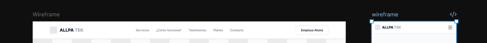

##### 2. Sección Principal (Hero Section)
* **Descripción:** Primera vista que recibe al usuario. Presenta la propuesta de valor con un titular de alto impacto (*"Producción agrícola garantizada, de la tierra a tu negocio"*), seguido de una bajada descriptiva que explica la conexión entre compradores B2B y agricultores. Incluye un llamado a la acción primario (*Cotizar Parcela*) y un bloque destacado con cuatro métricas cuantitativas clave (100% Pagos protegidos, 0% Riesgo de estafa, 15+ Hectáreas gestionadas, 25% Ahorro promedio).

  

##### 3. Sección de Servicios y Propuestas de Valor (Grid de Tarjetas)
* **Descripción:** Disposición en cuadrícula de tarjetas interactivas que resumen los pilares operativos de la plataforma:
  * **Selección de Parcelas y Terrenos:** Explicación del filtrado por suelo, zona geográfica y capacidad de cultivo.
  * **Fondos Protegidos en Custodia:** Detalle de la bóveda financiera y liberación progresiva por hitos.
  * **Trazabilidad e Inspección en Tiempo Real:** Acceso a reportes fotográficos, notas de insumos y avances validados.
  * **Asistencia Inteligente y Monitoreo Climático:** Explicación del sistema de alertas tempranas (heladas, sequías, plagas) respaldado por datos.
 

  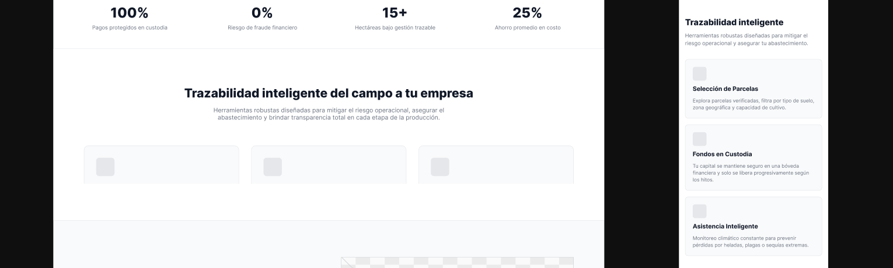

##### 4. Sección Garantía de Pagos por Hitos (Diagrama de Proceso)
* **Descripción:** Muestra de forma secuencial la línea de tiempo del modelo *Escrow*, conectando visualmente el texto explicativo con imágenes del trabajo en campo:
  * **Hito 1:** Firma de contrato y bloqueo del capital inicial en custodia segura.
  * **Hito 2:** Verificación de siembra y liberación de fondos para insumos.
  * **Hito 3:** Inspección de desarrollo y monitoreo climático en tiempo real.
  * **Hito 4:** Validación de cosecha y aprobación de calidad de producción.
  * **Hito 5:** Entrega final del lote y liberación del saldo restante.
 

  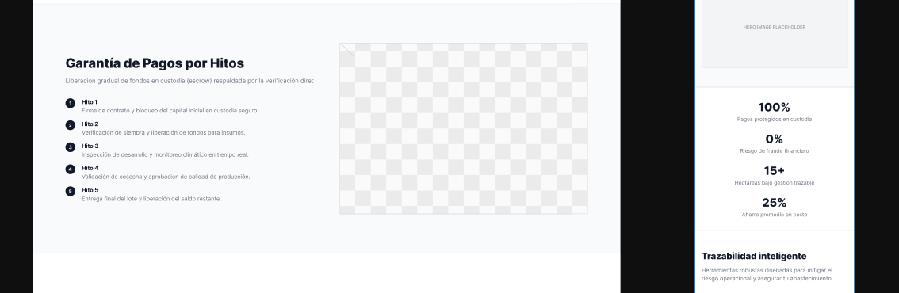

##### 5. Sección de Testimonios (Confianza Respaldada por Resultados)
* **Descripción:** Bloque de prueba social organizado en tres tarjetas verticales. Presenta testimonios reales de compradores B2B y productores (Carlos Mendoza Ríos, Miguel Huamán, Valeria Benavides), acompañados de su fotografía, rol, calificación en estrellas y métricas de éxito obtenidas al usar la plataforma.

  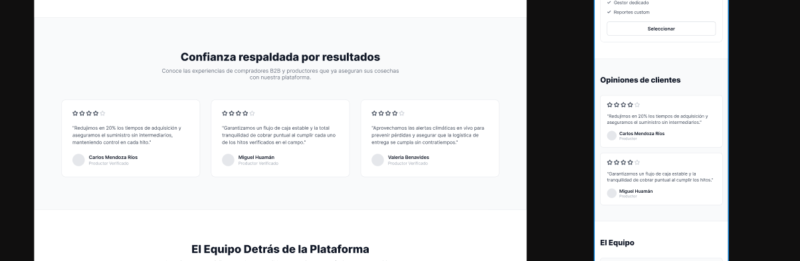

##### 6. Sección de Planes de Producción (Cuadro Comparativo)
* **Descripción:** Muestra tres tarjetas de suscripción alineadas horizontalmente (*Básico*, *Pro* y *Empresarial*):
  * **Básico ($50/mes):** Enfocado en 1 parcela activa, custodia de 4 hitos, soporte por correo y fotos georreferenciadas.
  * **Pro ($123/mes - Destacado):** Diseñado para hasta 10 parcelas, evidencias GPS con validación Java, contratos PDF y alertas climáticas en vivo.
  * **Empresarial ($250/mes):** Para parcelas ilimitadas, integración API, gestor de cuenta dedicado y reportes personalizados.
  * Cada tarjeta incluye su respectivo botón de acción (*Empezar Ahora*, *Solicitar Demo*, *Contactar Ventas*).
 

  

##### 7. Sección de Equipo (El Equipo Detrás de la Plataforma)
* **Descripción:** Presenta al equipo técnico responsable de la arquitectura del producto. Incluye las tarjetas de los ingenieros de software del proyecto con su fotografía, nombre y rol profesional.

  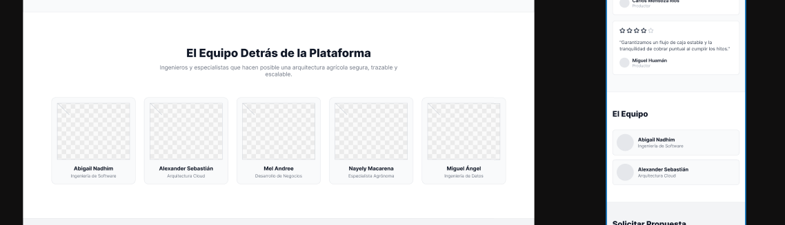

##### 8. Sección de Contacto y Solicitud de Propuesta Técnica
* **Descripción:** Formulario directo integrado sobre una imagen de fondo de campo agrícola. Permite al usuario solicitar el desglose de costos e información del modelo de custodia ingresando Nombre, Apellidos, Correo Electrónico y Teléfono, finalizando con el botón *Recibir Información*.

  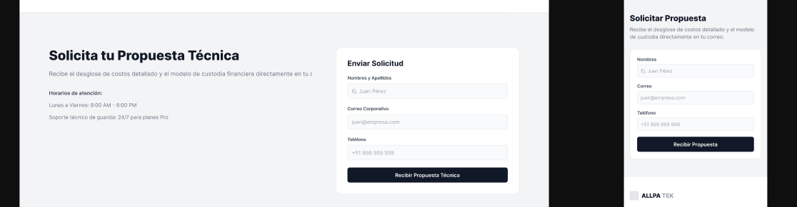

##### 9. Pie de Página (Footer)
* **Descripción:** Ubicado en el cierre de la página. Estructurado en cuatro columnas de navegación secundaria (*Navegación general*, *Servicios*, *Contacto & Horarios* de atención) junto con el logotipo de la marca y los derechos reservados de autor.

  

### 4.3.2. Landing Page Mock-up

En esta sección se presentan y explican los diseños de alta fidelidad (*mock-ups*) desarrollados para la *Landing Page* de **ALLPATEK**, abarcan tanto la versión para navegadores de escritorio (*Desktop Web Browser*) como para dispositivos móviles (*Mobile Web Browser*). La propuesta gráfica materializa la arquitectura de información y la estructura de los *wireframes* previamente definidos, aplicando rigurosamente los principios de diseño visual, accesibilidad e inclusión, e integrando la identidad del *Design System* oficial de la plataforma.

  

#### 1. Aplicación del Design System y Lenguaje Visual

* **Paleta de Colores Agrónoma:** Se utiliza una combinación de verdes profundos (tonos corporativos de **ALLPATEK**) para proyectar solidez y naturaleza, combinados con acentos en tonos ámbar/amarillo para los botones de acción principal (CTA) y estados de alerta, garantizando un punto focal inmediato de interacción.
* **Tipografía Escalable:** Implementación de una familia tipográfica sans-serif moderna, con una escala de pesos claramente diferenciada (*Bold* para títulos H1/H2, *Medium* para etiquetas de interfaz y *Regular* para párrafos de lectura), asegurando legibilidad en cualquier densidad de pantalla.
* **Componentes Reutilizables:** Integración del kit de UI institucional, incluyendo botones con estados de interacción (*default, hover, active, disabled*), tarjetas (*cards*) con bordes suaves y sombras leves para dar profundidad, e iconografía vectorial cohesiva para representar métricas y servicios.

#### 2. Principios de Diseño, Accesibilidad y Diseño Inclusivo (WCAG)

* **Relación de Contraste:** Todos los elementos de texto y componentes interactivos cumplen con el estándar WCAG AAA, asegurando un contraste mínimo de $4.5:1$ para texto regular y $3:1$ para títulos y elementos gráficos sobre fondos claros u oscuros.
* **Adaptabilidad Responsive:**
  * **Desktop:** Layout de 12 columnas con márgenes laterales amplios que aprovechan la pantalla panorámica sin dispersar la lectura.
  * **Mobile:** Layout de 4 columnas con apilamiento vertical fluido. Los menús horizontales se contraen en un cajón desplegable (*Drawer*) de fácil alcance táctil.
* **Zona Táctil Óptima (*Thumb Zone*):** En la versión *Mobile*, los botones principales y enlaces de conversión están ubicados en la franja central e inferior de la pantalla con una superficie interactiva mínima de $48 \times 48\text{px}$, facilitando el uso con una sola mano.

#### 3. Presentación de los Mock-ups de Alta Fidelidad

  

#### 4. Explicación Detallada de las Secciones del Mock-up

##### A. Encabezado y Navegación Principal (*Header*)
* **Desktop:** Barra fija con fondo semi-transparente (*backdrop blur*) que mantiene visible el logotipo en alta resolución, las opciones del menú con micro-interacciones al pasar el cursor (*hover*) y el botón *Empieza Ahora*.
* **Mobile:** Menú compacto con icono hamburguesa que despliega una lista de opciones accesible a pantalla completa.

  

  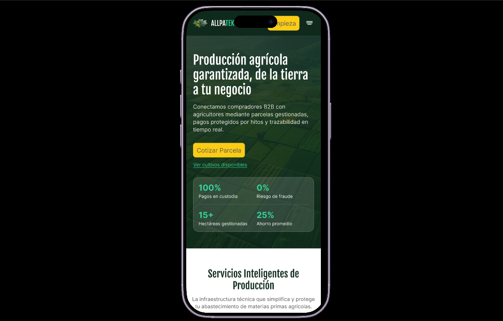

##### B. Sección de Servicios y Funcionalidades Principales
* **Composición:** Distribución en cuadrícula (bento grid) estructurada mediante un titular principal ("Producción agrícola garantizada, de la tierra a tu negocio") y un subtítulo explicativo del modelo de negocio. Alterna tarjetas informativas funcionales con imágenes aéreas reales de campos agrícolas gestionados.

  

  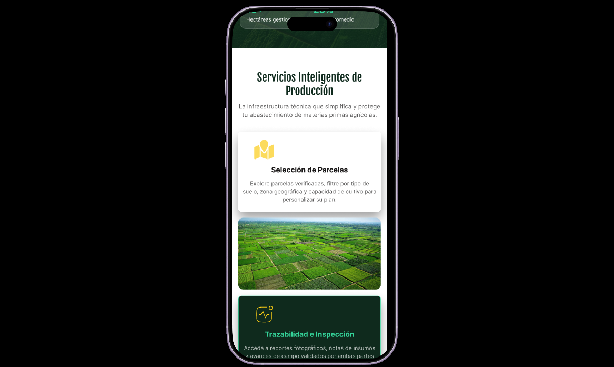

  

##### C. Módulo de Servicios y Custodia Escrow
* **Visualización de Tarjetas:** Las características de selección de parcelas, custodia financiera y monitoreo se representan mediante tarjetas con iconos a color, sombras de elevación y jerarquía de texto clara.
* **Flujo del Modelo por Hitos:** Diagrama interactivo paso a paso con conectores visuales que muestran el ciclo de vida del contrato desde el depósito inicial hasta la entrega de la cosecha.

  

  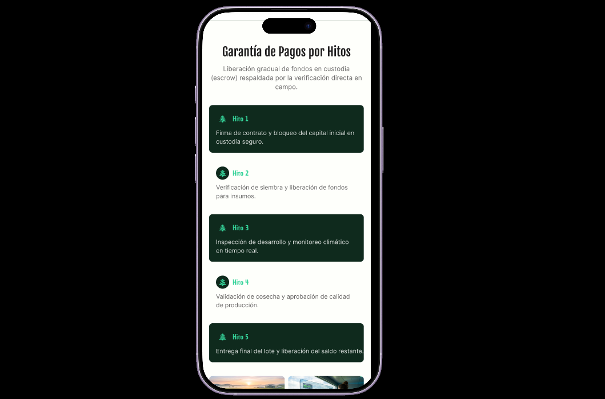

##### D. Planes de Producción y Cotización
* **Cuadro Comparativo de Planes:** Tarjetas de suscripción (*Básico*, *Pro*, *Empresarial*) donde la opción recomendada (*Pro*) se resalta mediante un borde distintivo y un indicador visual de *"Más Popular"*.
* **Formulario de Propuesta Técnica:** Bloque final con campos de entrada definidos (*inputs* con etiquetas claras y validación visual) para solicitar cotizaciones personalizadas.

  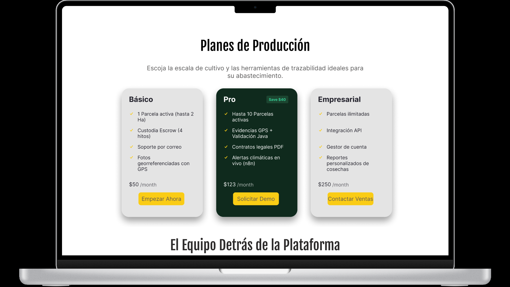

  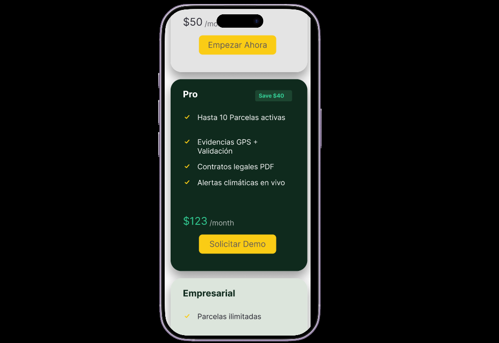

## 4.4. Web Applications UX/UI Design

Esta sección presenta la propuesta de diseño visual y de interacción desarrollada para la aplicación web de **ALLPATEK**. Se detallan los principios de diseño de interfaz (UI) y la experiencia de usuario (UX) integrados en los módulos privados de la plataforma. La propuesta abarca la diagramación de flujos de trabajo, pantallas clave, dashboard de monitoreo climático, gestión de parcelas y ejecución de contratos bajo el sistema de custodia *Escrow*, garantizando una navegación intuitiva, coherencia visual y una operativa eficiente para compradores  y productores agrícolas.

### 4.4.1. Web Applications Wireframes

Esta sección presenta los esquemas de baja y media fidelidad (wireframes) diseñados para las aplicaciones móviles del sistema, estructurados como base estructural y funcional previa al desarrollo de alta fidelidad.

#### Criterios de Diseño y Fundamentos Estructurales

* **Arquitectura de Información y Flujo Móvil:**
  * **Navegación Táctil Persistente:** Implementación de una barra de navegación inferior (*Bottom Navigation Bar*) con acceso directo a las vistas principales (*Inicio/Parcelas*, *Contratos*, *Pagos*, *Clima*), manteniendo al usuario ubicado espacialmente sin sobrecargar la pantalla.
  * **Disposición Vertical de Contenidos:** Distribución secuencial de tarjetas y bloques para favorecer el desplazamiento vertical (*Scroll*) natural en una sola mano.

* **Principios y Elementos de Diseño (UI/Layout):**
  * **Rejilla Móvil:** Maquetado sobre un layout de **4 columnas** con márgenes laterales de $16\text{px}$ y *gutters* de $16\text{px}$, asegurando alineación limpia.
  * **Espaciado Escalar (8px Grid):** Aplicación de márgenes internos de $8\text{px}$, $16\text{px}$ y $24\text{px}$ en tarjetas y contenedores para mantener jerarquía visual y separación clara entre bloques.
  * **Wireframing Neutral:** Uso exclusivo de escalas de grises para validar la estructura, contenido y contraste sin la distracción de elementos estéticos.

* **Diseño Inclusivo y Accesibilidad (WCAG 2.1 AA):**
  * **Zonas de Contacto Táctil (*Touch Targets*):** Todos los componentes interactivos (botones, campos de texto e íconos) respetan un área mínima de $44\times44\text{px}$ para evitar clics accidentales en dispositivos móviles.
  * **Claridad Tipográfica y Contraste:** Uso de tipografías legibles con contraste en escala de grises superior a $4.5:1$ en textos principales e inclusión de etiquetas (*labels*) permanentes en los formularios.

#### Estructura de Wireframes Móviles

##### 1. Wireframe: Autenticación y Selección de Rol
* **Descripción:** Esquema en pantalla única enfocado en el ingreso rápido de credenciales y selección de perfil:
  * **Contenedor Principal:** Módulo centrado con campos de entrada en bloque y botones sociales secundarios en la base.
  * **Selector de Rol:** Botones de opción amplia para conmutar entre *Agricultor* y *Comerciante B2B* antes del alta.

##### 2. Wireframe: Dashboard Móvil de Parcelas
* **Descripción:** Vista principal del inventario agrícola organizada para escaneo rápido:
  * **Buscador Superior:** Campo de búsqueda y filtrado por ubicación fija en la zona superior.
  * **Listado de Tarjetas (*Cards*):** Contenedores individuales que representan cada terreno, con espacios reservados para fotografía, estado, extensión y costo.

##### 3. Wireframe: Monitoreo Climático y Alertas
* **Descripción:** Estructura modular de lectura rápida para condiciones de campo:
  * **Métricas Principales (KPIs):** Cuadrícula de 2x2 para indicadores clave (*Temperatura*, *Humedad*, *Lluvia*, *Viento*).
  * **Lista de Alertas:** Bloques horizontales jerarquizados con ícono indicador y espacio para texto explicativo sobre el nivel de riesgo.

### 4.4.2. Web Applications Wireflow Diagrams

En esta sección se presentan los diagramas de **Wireflow**, los cuales combinan la estructura de los *wireframes* con la secuencia de un *user flow* para representar la interacción y el cambio de estado de la pantalla en cada paso de la navegación. 

Para garantizar consistencia en la arquitectura de información, se definieron previamente los *Task Flows* correspondientes a las rutas críticas de nuestros User Personas (**Agricultor** y **Comerciante B2B**), modelando explícitamente cada cambio de estado visual (efecto de selección, apertura de modales o actualización de badges) como un paso independiente con su respectivo wireframe.

#### Wireflow 1: Registro de Parcela y Publicación en la Plataforma
* **User Persona:** Alejandro Mendoza (Agricultor)
* **User Goal:** Publicar una nueva parcela agrícola registrando sus datos técnicos, ubicación GPS y fotos para ponerla a disposición de comerciantes B2B.

##### Explanación del Flujo:
1. **Paso 1 (Dashboard de Parcelas - Estado Inicial):** El usuario accede a la vista de *Gestión de Parcelas* y hace clic en el botón principal (*CTA*) "Publicar Nueva Parcela".
2. **Paso 2 (Formulario Multipaso - Paso 1: Datos Generales):** Se despliega el wireframe del formulario. El usuario ingresa nombre, área (Ha), tipo de suelo y costo. Al completar, acciona "Siguiente".
3. **Paso 3 (Formulario Multipaso - Paso 2: Geolocalización):** La pantalla cambia al estado de ubicación. El usuario selecciona departamento, provincia, distrito y presiona "Obtener Ubicación", lo que actualiza el mapa con la marca de coordenadas GPS.
4. **Paso 4 (Formulario Multipaso - Paso 3: Carga de Evidencia):** Muestra la zona *Drag & Drop*. El usuario sube los fotogramas; la pantalla se actualiza mostrando las miniaturas de las fotos y permitiendo designar la *Foto Principal*.
5. **Paso 5 (Confirmación y Actualización de Dashboard):** El usuario hace clic en "Guardar y Publicar Parcela". El flujo retorna al Dashboard, mostrando la nueva tarjeta agregada con el badge en estado *Disponible*.

#### Wireflow 2: Contratación y Firma Digital del Acuerdo Escrow
* **User Persona:** María Chen (Comerciante B2B)
* **User Goal:** Revisar los términos legales de un contrato de arrendamiento agrícola y formalizar el acuerdo mediante firma digital para activar la custodia de fondos.

##### Explicación del Flujo:
1. **Paso 1 (Detalle del Contrato - Estado Pendiente):** El usuario navega al módulo *Contratación* y selecciona un contrato en estado *Pendiente de Firma*.
2. **Paso 2 (Lectura y Verificación de Cláusulas):** Revisa el visor de contrato (partes involucradas, área de terreno y plan de desembolsos por hitos Escrow).
3. **Paso 3 (Captura de Firma Digital):** El usuario interactúa con el recuadro de firma (*Canvas*). Al dibujar su rúbrica táctil/mouse, el componente cambia de estado mostrando la firma renderizada y habilitando la casilla de verificación.
4. **Paso 4 (Aceptación de Términos):** Se marca la casilla "Acepto los términos y condiciones de custodia Escrow", activando visualmente el botón "Firmar y Activar Contrato".
5. **Paso 5 (Estado Final - Contrato Activo):** Tras procesar la firma, la pantalla cambia al estado de *Contrato Activo*, deshabilitando la edición y redirigiendo al usuario al panel de seguimiento de la Bóveda de Pagos.

#### Wireflow 3: Monitoreo Climático y Gestión de Alerta Crítica
* **User Persona:** Alejandro Mendoza (Agricultor)
* **User Goal:** Consultar el estado agronómico del cultivo y revisar una alerta ambiental para tomar medidas preventivas en campo.

##### Explicación del Flujo:
1. **Paso 1 (Navegación al Módulo Climático):** El usuario hace clic en "Alertas Climáticas" desde la barra de navegación lateral.
2. **Paso 2 (Lectura de KPIs de Sensores):** Visualiza las tarjetas de *Temperatura*, *Humedad*, *Precipitación* y *Viento* con sus indicadores de rango óptimo.
3. **Paso 3 (Identificación de Alerta Crítica):** El usuario detecta la primera tarjeta del feed de alertas resaltada en rojo (*Alerta de Helada - Riesgo Crítico*).
4. **Paso 4 (Interacción de Expansión/Detalle):** Al hacer clic sobre el contenedor de la alerta, la tarjeta cambia de estado colapsado a expandido, desplegando recomendaciones agronómicas directas y la fuente del reporte.

### 4.4.3. Web Applications Mock-ups

##### 1. Sección de Registro de Usuario (Modal de Selección de Rol y Formulario)
* **Descripción:** Disposición en contenedor modal centrado sobre rejilla de 6 columnas en modo oscuro que gestiona el alta de usuarios:
  * **Selección de Rol Adaptativo:** Tarjetas interactivas (*Agricultor* y *Comerciante*) con íconos temáticos y estado activo en dorado para personalización del flujo.
  * **Formulario Progresivo Secuencial:** Campos de entrada verticalmente alineados con regla de 8px para captura de datos sin saturación visual.
 

  

##### 2. Sección de Inicio de Sesión (Autenticación Directa y Social)
* **Descripción:** Layout de columna única enfocado en minimizar la carga cognitiva durante el acceso a la plataforma:
  * **Credenciales Tradicionales:** Inputs de correo y contraseña con opción de revelar texto y enlaces de recuperación de alto contraste.
  * **Acceso Principal Relevante:** Botón institucional de ancho completo en tono dorado para guiar la interacción principal (*CTA*).

  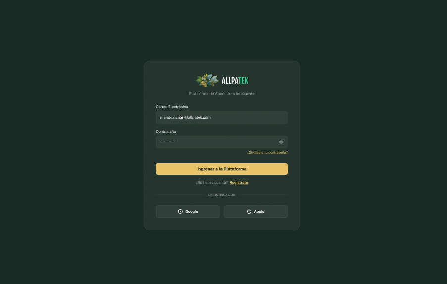

##### 3. Sección de Gestión de Parcelas Agrícolas (Dashboard en Grid de Tarjetas)
* **Descripción:** Cuadrícula de tarjetas que muestra el inventario de terrenos con badges de estado (*Disponible*, *En Producción*, *En Mantenimiento*):
  * **Información Técnica Clave:** Detalle de hectáreas, coordenadas GPS, tipo de suelo y costo por campaña.
  * **Acciones Rápidas:** Opciones directas de edición y eliminación por cada tarjeta, junto al botón principal "Publicar Nueva Parcela".

  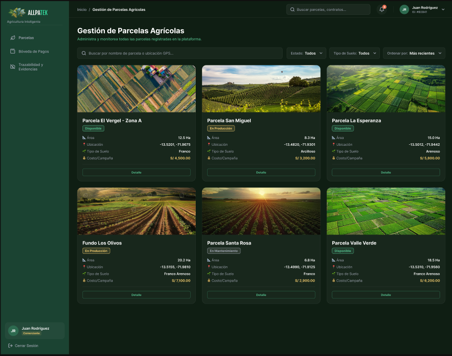

##### 4. Sección de Registro de Nueva Parcela (Formulario Multipaso)
* **Descripción:** Formulario modular dividido en etapas con indicador de progreso (*Datos Generales*, *Geolocalización*, *Fotografías*):
  * **Geolocalización e Integración de Mapa:** Selección por departamento/provincia e inserción de coordenadas con mapa interactivo.
  * **Carga de Evidencia Visual:** Zona *Drag & Drop* para adjuntar imágenes con vista previa y designación de imagen principal.
 

  

##### 5. Sección de Perfil de Usuario (Gestión de Datos y Cuenta)
* **Descripción:** Vista centralizada de la información personal del usuario con opción de actualización de datos:
  * **Header de Identidad:** Fotografía de perfil, nombre, badge de rol (*Agricultor*) y fecha de antigüedad.
  * **Formulario de Datos Personales:** Campos para DNI, teléfono, dirección principal, correo verificado y tipo de cuenta activa.

 

  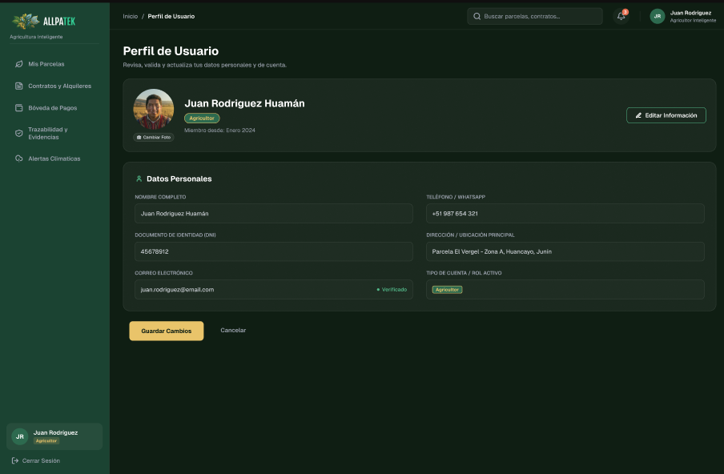

##### 6. Sección de Firma y Confirmación de Contrato (Contratos y Alquileres)
* **Descripción:** Vista dividida en dos columnas para la lectura legal y la formalización de acuerdos bajo el modelo Escrow:
  * **Visor del Acuerdo Legal:** Mapeo de partes involucradas, cláusulas de arrendamiento y plan de desembolsos por hitos en bloques estructurados.
  * **Panel de Autenticación Digital:** Recuadro de firma manuscrita digital, confirmación de términos de custodia Escrow y botón principal de activación en dorado.
 
 

  

##### 7. Sección de Bóveda de Pagos (Custodia Financiera Escrow)
* **Descripción:** Panel de control para la gestión de custodia y liberación progresiva de fondos vinculados a contratos activos:
  * **Métricas Financieras Generales:** Tarjetas superiores con KPIs de monto total custodias, fondos liberados y saldos pendientes de aprobación.
  * **Línea de Tiempo de Hitos:** Flujo secuencial de 4 etapas (*Suelo*, *Siembra*, *Desarrollo*, *Cosecha*) con conectores y badges de estado (*Completado*, *En Revisión*, *Bloqueado*).

  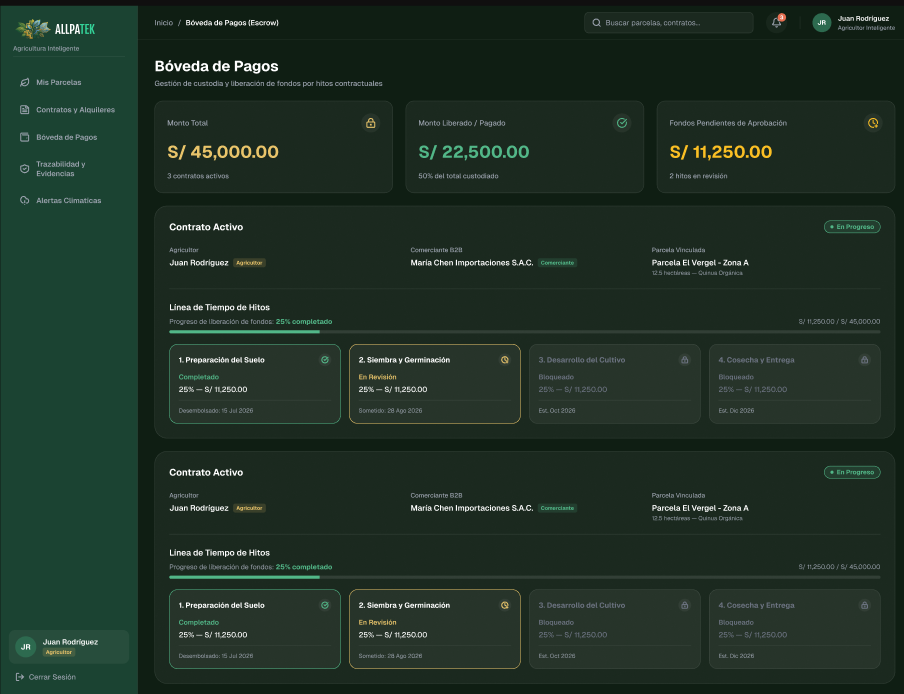

##### 8. Sección de Monitoreo Agronómico y Riesgo Climático (Alertas Climáticas)
* **Descripción:** Dashboard de seguimiento ambiental en tiempo real orientado a la prevención de riesgos agrícolas:
  * **Tarjetas de Sensores Ambientales:** Visualización de temperatura, humedad, precipitación y viento con micro-gráficos de tendencia.
  * **Feed de Alertas Jerarquizado:** Contenedores de riesgo clasificados por color y nivel de severidad (*Crítica*, *Moderada*, *Normal*) para actuación inmediata.

  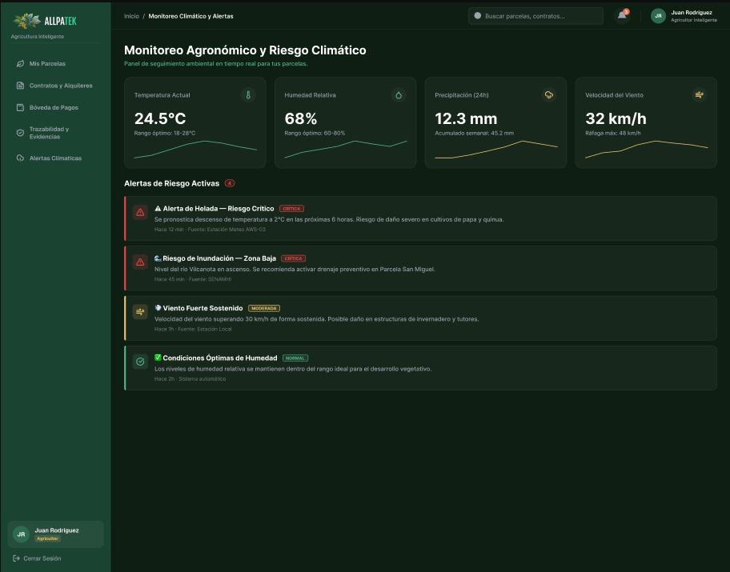

### 4.4.4. Web Applications User Flow Diagrams

Esta sección presenta la propuesta formal de **User Flows** mapeados a partir de los diagramas de Wireflow previamente validados. Cada flujo integra los *Mock-ups* finales de alta fidelidad para representar la experiencia visual definitiva, definiendo con claridad tanto la ruta principal o esperada (*Happy Path*) como las decisiones y rutas de excepción (*Unhappy Paths*).

#### User Flow 1: Registro de Parcela Agrícola y Publicación en Plataforma

* **User Persona:** Alejandro Mendoza (Agricultor)
* **User Goal:** Publicar una nueva parcela en el catálogo para ponerla a disposición de comerciantes B2B, garantizando la carga correcta de datos técnicos, coordenadas GPS y fotos del terreno.

##### Explicación del Flujo y Condiciones:

* **Happy Path (Ruta Esperada):**
  1. **Inicio:** El usuario ingresa a *Gestión de Parcelas* y presiona el *CTA* "Publicar Nueva Parcela".
  2. **Paso 1 (Datos Generales):** Completa exitosamente el nombre, área en hectáreas, tipo de suelo y costo/campaña. Presiona "Siguiente".
  3. **Paso 2 (Geolocalización):** Selecciona departamento, provincia, distrito y presiona "Obtener Ubicación". El sistema valida las coordenadas GPS y renderiza el mapa.
  4. **Paso 3 (Fotografías):** Adjunta al menos 3 imágenes mediante *Drag & Drop*, asigna la *Foto Principal* y selecciona "Guardar y Publicar Parcela".
  5. **Resultado:** El sistema valida los datos y redirige al Dashboard, mostrando la tarjeta en estado *Disponible*.

* **Unhappy Paths (Rutas Alternativas y Excepciones):**
  * **Datos Incompletos o Formato Inválido (Paso 1):** Si el usuario deja campos requeridos vacíos o ingresa un costo no numérico, el botón "Siguiente" permanece deshabilitado o el input genera un borde de error en rojo.
  * **Error de Geolocalización / Coordenadas Nulas (Paso 2):** Si el navegador o dispositivo no tiene permisos de GPS activados, la plataforma muestra un *Banner de Advertencia* solicitando la selección manual en el mapa o el reintento de la geolocalización.
  * **Formato o Peso de Imagen No Permitido (Paso 3):** Si se intenta subir un archivo distinto a JPG/PNG o que supere el tamaño máximo ($5\text{MB}$), el contenedor de carga muestra un mensaje de alerta y no procesa el archivo hasta ser reemplazado.

#### User Flow 2: Formalización y Firma Digital del Contrato Escrow

* **User Persona:** María Chen (Comerciante B2B)
* **User Goal:** Revisar y firmar digitalmente un contrato de arrendamiento agrícola para proceder al bloqueo e inicio de la custodia de fondos en la Bóveda de Pagos.

##### Explicación del Flujo y Condiciones:

* **Happy Path (Ruta Esperada):**
  1. **Inicio:** La usuaria navega al módulo *Contratación* y hace clic en una propuesta con estado *Pendiente de Firma*.
  2. **Revisión del Acuerdo:** Examina el visor de contrato (partes, cláusulas y plan de desembolsos por hitos Escrow).
  3. **Rúbrica Digital:** Dibuja su firma en el recuadro interactivo (*Canvas*).
  4. **Aceptación y Confirmación:** Marca la casilla de verificación de términos Escrow y presiona el botón "Firmar y Activar Contrato".
  5. **Resultado:** El sistema registra la firma, cambia el estado a *Contrato Activo* y habilita la visualización de la línea de tiempo en la *Bóveda de Pagos*.

* **Unhappy Paths (Rutas Alternativas y Excepciones):**
  * **Firma No Realizada / Canvas Vacío:** Si la usuaria marca la casilla de términos pero no dibuja la firma en el recuadro, el botón "Firmar y Activar Contrato" se mantiene en estado deshabilitado.
  * **Rechazo o Solicitud de Corrección:** Si la usuaria identifica un error en los montos o hectáreas del acuerdo, puede seleccionar la acción secundaria "Rechazar / Solicitar Modificación", abriendo un modal para enviar observaciones al Agricultor y pausar el flujo.

#### User Flow 3: Consulta de Monitoreo Climático y Gestión de Alerta

* **User Persona:** Alejandro Mendoza (Agricultor)
* **User Goal:** Evaluar las métricas ambientales de sus parcelas y revisar detalles de alertas críticas para tomar decisiones preventivas sobre sus cultivos.

##### Explicación del Flujo y Condiciones:

* **Happy Path (Ruta Esperada):**
  1. **Inicio:** El usuario accede al menú lateral y selecciona "Alertas Climáticas".
  2. **Lectura de Sensores:** Revisa los KPIs de *Temperatura*, *Humedad*, *Precipitación* y *Viento*.
  3. **Identificación de Alerta:** Selecciona la primera tarjeta del feed (*Alerta de Helada - Riesgo Crítico*).
  4. **Visualización de Recomendación:** La tarjeta expande su contenido, mostrando el diagnóstico técnico y el protocolo de acción sugerido.

* **Unhappy Paths (Rutas Alternativas y Excepciones):**
  * **Pérdida de Conexión de Sensores / Datos Desactualizados:** Si las estaciones meteorológicas no envían señal, las tarjetas de KPI muestran un estado *Offline* con la última hora de sincronización y un botón de "Reintentar Lectura".

## 4.5. Web Applications Prototyping

En esta sección se presentan los prototipos interactivos de alta fidelidad desarrollados para navegadores **Desktop** y **Mobile Web**, los cuales simulan la experiencia real de navegación acorde a los trayectos definidos en los *User Flow Diagrams*. 

#### Criterios para las Decisiones de Interacción y Arquitectura de Información

La estrategia de interacción de **ALLPATEK** se diseñó bajo un enfoque enfocado en el usuario y orientado a tareas, asegurando una transición fluida desde el primer contacto hasta las operaciones avanzadas del sistema:

* **Relación con la Arquitectura de Información:** 
  * **Sistema de Navegación Persistente:** Se implementó una barra lateral (*Sidebar*) en Desktop y un menú colapsable (*Drawer/Hamburger*) en Mobile Web. Esta estructura garantiza que el usuario mantenga claridad de su ubicación espacial (*Breadcrumbs mentales*) y pueda alternar sin fricción entre módulos clave como *Gestión de Parcelas*, *Bóveda de Pagos Escrow* y *Alertas Climáticas*.
  * **Jerarquía de Visualización Contenida:** El contenido se organiza modularmente mediante tarjetas interactivas (*Cards UI*) y tablas de datos que colapsan/expanden información técnica según la densidad requerida por cada dispositivo.

* **Tipos de Interacciones Seleccionadas:**
  * **Microinteracciones y Feedback Inmediato:** Se incorporaron variantes de componentes en Figma para estados *Hover*, *Focus*, *Pressed* y *Active*. Los botones principales y tarjetas cambian de elevación y tono al interactuar, proporcionando retroalimentación visual inmediata.
  * **Interacciones de Flujo Guiado:** Para procesos complejos como la *Firma de Contratos* y la *Carga de Evidencia en Nuevas Parcelas*, se emplearon patrones de interacción progresiva (*Step-by-step Steppers* y zonas de *Drag & Drop*), reduciendo la carga cognitiva.
  * **Navegación Táctil y Enfoque Adaptativo:** En la versión Mobile Web, los puntos de contacto (*Touch Targets*) se mantuvieron por encima del área mínima de $44\times44\text{px}$, optimizando gestos de desplazamiento vertical (*Scroll*) y selección rápida sin sacrificar contraste ni legibilidad.

#### Demostración y Flujos de Interacción en Video

A continuación, se presentan los enlaces y capturas de los videos explicativos subidos a Microsoft Stream, donde se demuestra el recorrido de usuario y las validaciones del prototipo:

##### 1. Prototipo Desktop Web – Flujo Principal de Gestión y Custodia Escrow
* **Descripción del Video:** Explicación detallada de la experiencia en pantalla completa, abarcando desde la autenticación por roles, la exploración de parcelas agrícolas en grid, hasta la firma digital de acuerdos y la liberación de fondos por hitos en la Bóveda de Pagos.
* **Captura de Pantalla:**  
* **Enlace al Video:** [Ver Demostración Desktop Web en Microsoft Stream](https://stream.microsoft.com/enlace-al-video-desktop)

##### 2. Prototipo Mobile Web Browser – Adaptabilidad y Monitoreo en Campo
* **Descripción del Video:** Demostración de la respuesta adaptativa en navegadores móviles, enfocada en la facilidad de uso para agricultores en campo: consulta de alertas climáticas en tiempo real, navegación táctil y carga directa de fotografías.
* **Captura de Pantalla:**  
* **Enlace al Video:** [Ver Demostración Mobile Web en Microsoft Stream](https://stream.microsoft.com/enlace-al-video-mobile)

## 4.6. Domain-Driven Software Architecture
### 4.6.1. Design-Level Event Storming
### 4.6.2. Software Architecture Context Diagram
### 4.6.3. Software Architecture Container Diagrams
### 4.6.4. Software Architecture Components Diagrams

## 4.7. Software Object-Oriented Design
### 4.7.1. Class Diagrams

## 4.8. Database Design
### 4.8.1. Database Diagrams

# Capítulo V: Product Implementation, Validation & Deployment

## 5.1. Software Configuration Management
### 5.1.1. Software Development Environment Configuration
### 5.1.2. Source Code Management
### 5.1.3. Source Code Style Guide & Conventions
### 5.1.4. Software Deployment Configuration

## 5.2. Landing Page, Services & Applications Implementation
### 5.2.1. Sprint 1
#### 5.2.1.1. Sprint Planning 1
#### 5.2.1.2. Aspect Leaders and Collaborators
#### 5.2.1.3. Sprint Backlog 1
#### 5.2.1.4. Development Evidence for Sprint Review
#### 5.2.1.5. Execution Evidence for Sprint Review
#### 5.2.1.6. Services Documentation Evidence for Sprint Review
#### 5.2.1.7. Software Deployment Evidence for Sprint Review
#### 5.2.1.8. Team Collaboration Insights during Sprint
### 5.2.2. Sprint 2
#### 5.2.2.1. Sprint Planning 2
#### 5.2.2.2. Aspect Leaders and Collaborators
#### 5.2.2.3. Sprint Backlog 2
#### 5.2.2.4. Development Evidence for Sprint Review
#### 5.2.2.5. Execution Evidence for Sprint Review
#### 5.2.2.6. Services Documentation Evidence for Sprint Review
#### 5.2.2.7. Software Deployment Evidence for Sprint Review
#### 5.2.2.8. Team Collaboration Insights during Sprint
### 5.2.3. Sprint 3
#### 5.2.3.1. Sprint Planning 3
#### 5.2.3.2. Aspect Leaders and Collaborators
#### 5.2.3.3. Sprint Backlog 3
#### 5.2.3.4. Development Evidence for Sprint Review
#### 5.2.3.5. Execution Evidence for Sprint Review
#### 5.2.3.6. Services Documentation Evidence for Sprint Review
#### 5.2.3.7. Software Deployment Evidence for Sprint Review
#### 5.2.3.8. Team Collaboration Insights during Sprint
### 5.2.4. Sprint 4
#### 5.2.4.1. Sprint Planning 4
#### 5.2.4.2. Aspect Leaders and Collaborators
#### 5.2.4.3. Sprint Backlog 4
#### 5.2.4.4. Development Evidence for Sprint Review
#### 5.2.4.5. Execution Evidence for Sprint Review
#### 5.2.4.6. Services Documentation Evidence for Sprint Review
#### 5.2.4.7. Software Deployment Evidence for Sprint Review
#### 5.2.4.8. Team Collaboration Insights during Sprint

## 5.3. Validation Interviews
### 5.3.1. Diseño de Entrevistas
### 5.3.2. Registro de Entrevistas
### 5.3.3. Evaluaciones según heurísticas

## 5.4. Video About-the-Product

# Conclusiones y recomendaciones

## Conclusiones
## Recomendaciones

# Video About-the-Team

# Bibliografía

# Anexos
